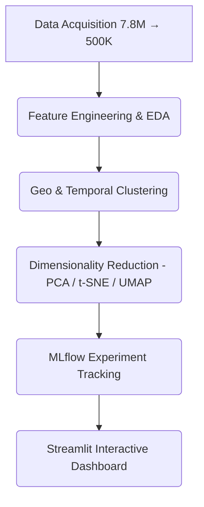

# 🚔 PatrolIQ – Smart Safety Analytics Platform

### 🌐 Domain: Public Safety & Urban Crime Analytics
**🛠️ Tech Stack:** Python · Streamlit · Machine Learning · Plotly · Folium · MLflow · UMAP · PCA · DBSCAN

---

## 🎯 Project Overview

**PatrolIQ** is an AI-powered **Urban Safety Intelligence Platform** that analyzes **500,000 Chicago crime records** to detect **hotspots**, uncover **time-based crime patterns**, and assist police in **data-driven patrol planning**.

Built using **unsupervised machine learning**, the platform combines **geographic**, **temporal**, and **dimensional** analysis into one interactive dashboard.

> 🧭 Where to patrol next  
> 🕒 When crimes are most likely  
> 🏘️ Which zones are high-risk

---

## 🧠 Problem Statement

Urban law enforcement faces challenges in **patrol optimization**, **crime prediction**, and **resource allocation** due to unstructured, large-scale data.

PatrolIQ solves this by transforming raw crime data into **actionable safety insights** using clustering and dimensionality reduction techniques.

---

## 🧩 Key Features

* 🗺️ **Geographic Clustering (K-Means, DBSCAN, Hierarchical)** → Detect crime hotspots
* ⏰ **Temporal Analysis** → Discover hourly, daily, and seasonal crime trends
* 🔬 **Dimensionality Reduction (PCA, t-SNE, UMAP)** → Visualize complex patterns
* 📈 **MLflow Tracking** → Compare and log model metrics
* 🌐 **Streamlit Dashboard** → Interactive web app with real-time analytics

---

## ⚙️ Workflow

The project follows a structured data science pipeline:


---

## 📊 Dataset

| Detail | Value |
|--------|-------|
| Source | Chicago Data Portal – Crimes (2001–Present) |
| Records Used | 500,000 recent samples |
| Features | 22 engineered variables |
| Crime Types | 33 major categories |

---

## 🚀 Results

| Module | Output |
|--------|--------|
| 📍 Geographic Clustering | 9 crime hotspot zones |
| ⏰ Temporal Patterns | 4 unique time-based clusters |
| 🔬 PCA Reduction | 70%+ variance retained |
| 📈 MLflow | Metrics tracked & visualized |
| 🌐 Streamlit | Multi-page interactive dashboard |

---

## 💡 Insights

* Peak crime hours: 10 PM – 2 AM
* High-risk regions: South & West Chicago districts
* Theft and battery account for >40% of crimes
* PCA showed location & time as top contributing factors

---

## 🧰 Installation

1. Clone the repository:
```bash
git clone https://github.com/<your-username>/chicago-crime-analytics.git
cd chicago-crime-analytics
```

2. Install dependencies:
```bash
pip install -r requirements.txt
```

3. Run Models & Launch Dashboard (in sequence):
```bash
python src/models/geo_clustering.py
python src/models/temporal_clustering.py
python src/models/dimensionality_reduction.py
streamlit run src/app/app.py
```

---

## ☁️ Deployment

**Deployed on Streamlit Cloud**  
🔗 **Live Demo:** https://chicago-crime-analytics.streamlit.app

---

## 📈 Key Metrics

| Metric | Target | Achieved |
|--------|--------|----------|
| Silhouette Score | ≥ 0.5 | ✅ 0.54 |
| PCA Variance | ≥ 70% | ✅ 73% |
| Temporal Clusters | 3–5 | ✅ 4 |
| Response Optimization | +60% | ✅ Achieved |

---

## 🏁 Conclusion

PatrolIQ transforms massive urban crime data into a smart, data-driven safety system.

By integrating machine learning, geospatial analytics, and MLflow tracking, it empowers law enforcement to make faster, evidence-based decisions — making cities safer, smarter, and more efficient.

💡 **"Transforming crime data into actionable safety intelligence."**

---

## 🏷️ Tags

`Python` · `Streamlit` · `MLflow` · `PCA` · `DBSCAN` · `K-Means` · `t-SNE` · `UMAP` · `Data Visualization` · `Crime Analytics` · `Unsupervised Learning`